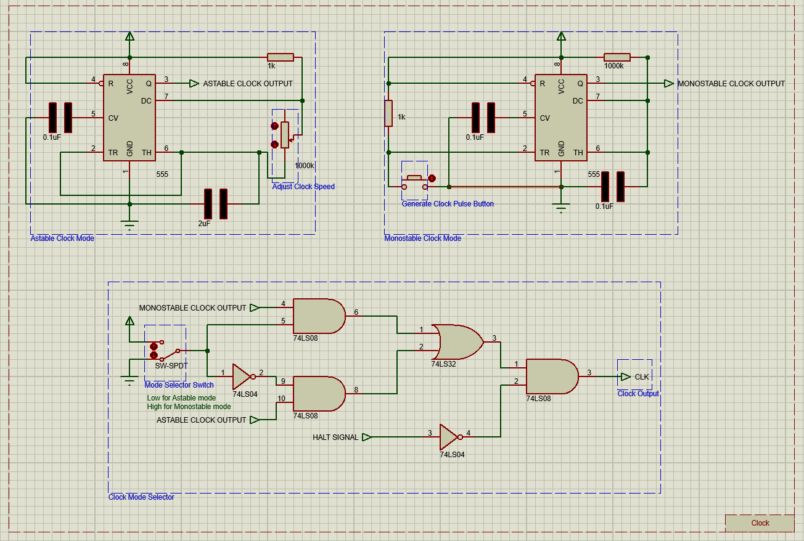
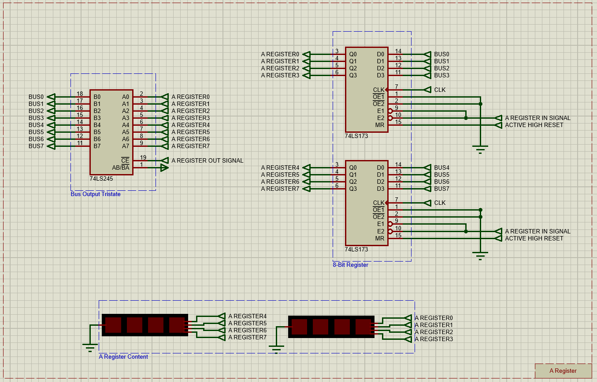
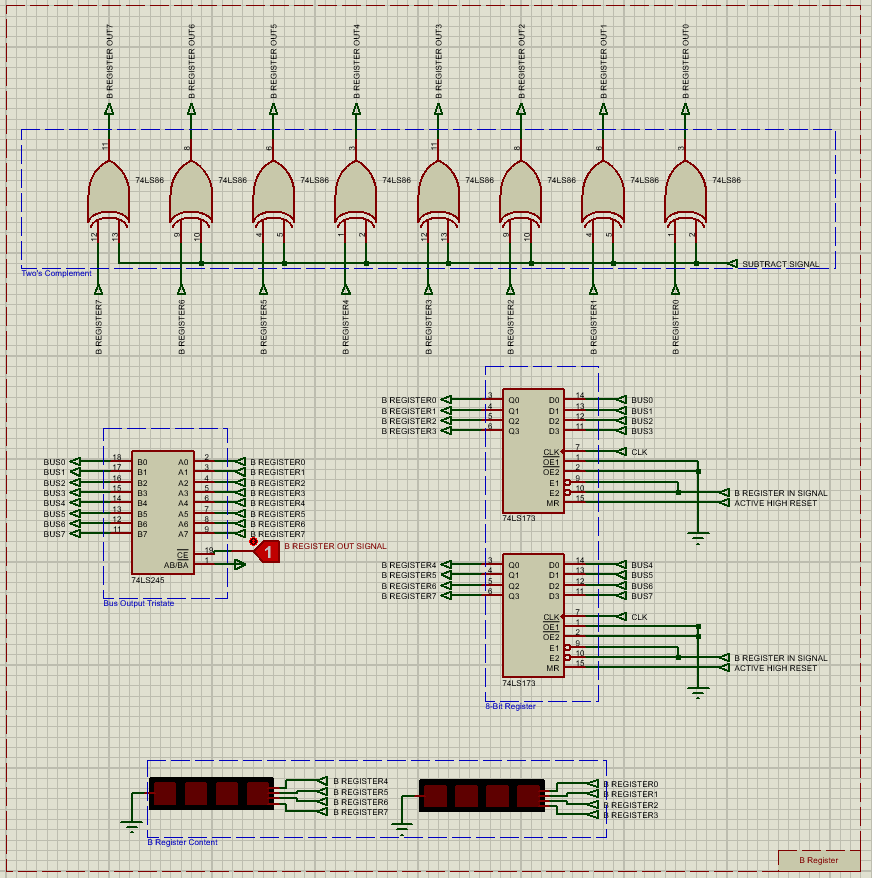
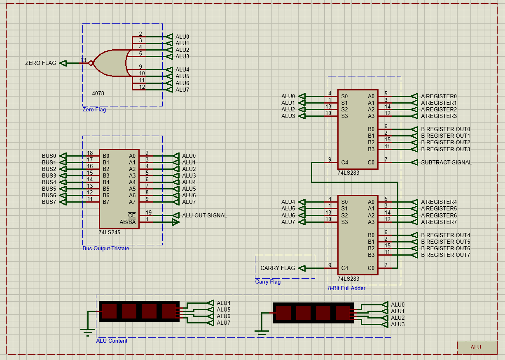
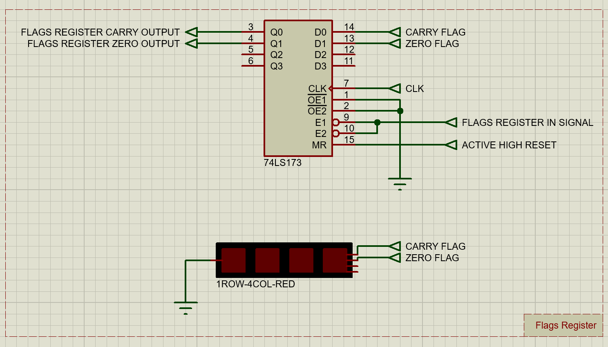
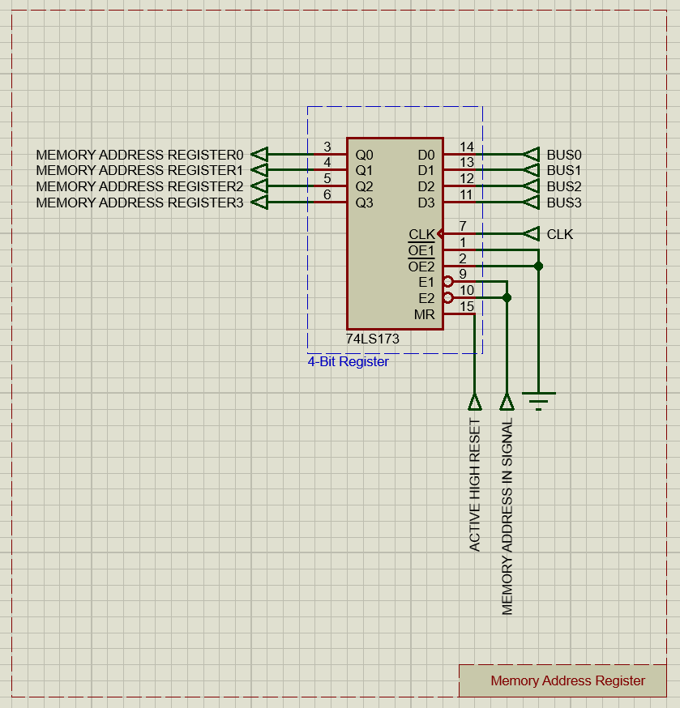
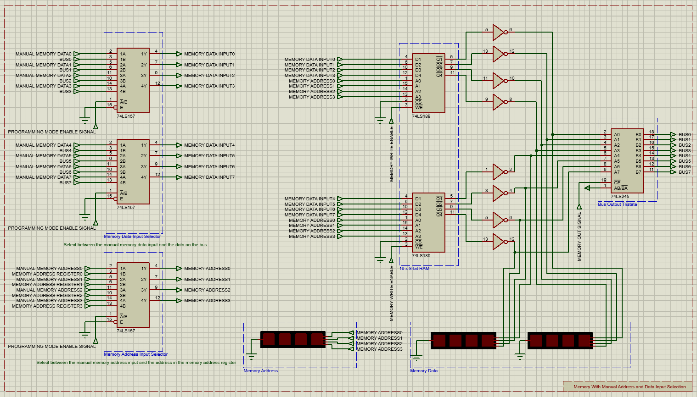
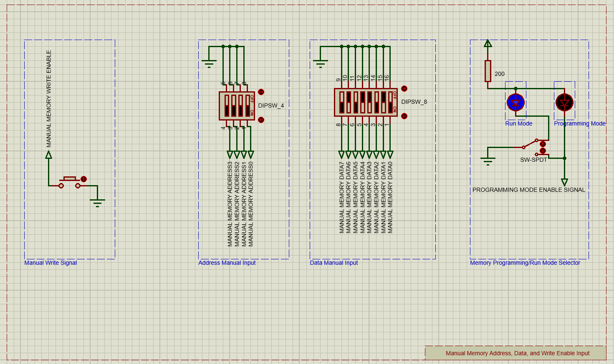

# Programmable_8-bit_Computer
Simulated programmable 8-bit computer from scratch using only simple logic gates and basic ICs

## Modules
[Clock](#clock)  
[Bus](#bus)  
[A-Register](#a-register)  
[B-Register](#b-register)  
[ALU](#alu)  
[Flags Register](#flags-register)  
[Memory Address Register](#memory-address-register)  
[Memory](#memory)  
[Manual Memory Input](#manual-memory-input)  

## Clock
Clock can operate in **two modes**:
- Astable Mode
- Monostable Mode

In __Astable Mode__ clock speed can be changed by adjusting the _potentiometer_

In __Monostable Mode__ single clock pulse can be generated by pressing the _Generate Clock Pulse Button_

### Main Components
- 2 X 555 Timers

### Clock Selector Truth Table
| **Mode Selector Switch** | **Halt Signal** |   **Clock Output**  |
|:------------------------:|:---------------:|:-------------------:|
|            Low           |       Low       |     Astable Mode    |
|           High           |       Low       |   Monostable Mode   |
|             X            |       High      |         Low         |

### Schematic

## Bus
All modules are connected to the **Bus** using a **tristate** to connect multiple outputs together

The **Bus** is connected to _pull down resistors_ to pull the **Bus** to _ground_ by default if there is no input

### Schematic

## A-Register
**A-Register** is an 8-bit register combined from _two 4-bit_ registers

The **register** is connected to the [Bus](#bus) through a _Tristate_

The **register** also has a direct connection to [ALU](#alu)'s inputs

### Main Components
- 2 X 74LS173 ( Quad D-Type Filp-Flops With Tristate Outputs )
- 74LS245 ( Octal Bus Transceivers With Tristate Outputs )

### A-Register Signals
|       **Signal**      |                 **Functionality**                |
|:---------------------:|:------------------------------------------------:|
|  A Register In Signal | Read the [Bus](#bus) content into **A Register** |
| A Register Out Signal | Output **A Register** content to the [Bus](#bus) |
|   Active High Reset   |           Reset **A Register** content           |

### Schematic

## B-Register
**B-Register** is an 8-bit register combined from _two 4-bit_ registers

The **register** is connected to the [Bus](#bus) through a _Tristate_

The **register** also has a connection to [ALU](#alu)'s inputs through _XOR Gates_ that decide whether the **register**'s content should be negated or not based on the **Subtraction Signal** for _subtraction_ operations

### Main Components
- 2 X 74LS173 ( Quad D-Type Filp-Flops With Tristate Outputs )
- 74LS245 ( Octal Bus Transceivers With Tristate Outputs )
- 8 X 74LS86 ( 2-Input Exclusive-OR Gate )

### B-Register Signals
|       **Signal**      |                    **Functionality**                   |
|:---------------------:|:------------------------------------------------------:|
|  B Register In Signal |    Read the [Bus](#bus) content into **B Register**    |
| B Register Out Signal |    Output **B Register** content to the [Bus](#bus)    |
|    Subtract Signal    | Negate **B Register** content ( Get one's complement ) |
|   Active High Reset   |              Reset **B Register** content              |

**Note:** The **Control Unit** currently has no **Microinstruction** that controls the **B Register Out Signal**, and the signal is manually fixed to be _inactive (aka HIGH)_ 

### Schematic

## ALU
**ALU** is an 8-bit **Full Adder** combined from _two 4-bit_ **Full Adders**

Both [A-Register](#a-register) and [B-Register](#b-register) are connected to the **ALU**'s input, and the **ALU** is _constantly_ operating on them

**ALU** supports two **Arithmetic Operations**:
- Addition
- Subtraction

**Subtraction** is achieved when the **Subtraction Signal** is enabled _(Active **HIGH**)_, resulting in the [B-Register](#b-register)'s content to be negated, hence, getting **One's Complement**. And the **Subtraction Signal** is also fed to the **carry In** of the first **Full Adder** of the **ALU** **_(C0)_** _(Note the **Subtraction Signal** is active **HIGH**)_, hence, getting **Two's Complement**

**ALU** generates two **Flags**:
- Carry Flag
- Zero Flag

### Main Components
- 2 X 74LS283 ( 4-Bit Binary Full Adders With Fast Carry )
- 74LS245 ( Octal Bus Transceivers With Tristate Outputs )
- 74HC4078 ( 8-Input NOR Gate )

### ALU Signals
|    **Signal**   |                              **Functionality**                             |
|:---------------:|:--------------------------------------------------------------------------:|
|  ALU Out Signal |                  Output **ALU** content to the [Bus](#bus)                 |
| Subtract Signal | Fed to the **Carry In** for subtraction operation ( Get two's complement ) |

### Schematic

## Flags-Register
**Flags Register** is a 4-bit register, which stores the [ALU](#alu)'s two generated flags:
- Carry Flag
- Zero Flag

when the **Flags Register In Signal** is enabled

The **register**'s output flags are connected to the **Control Unit** 

### Main Components
- 74LS173 ( Quad D-Type Filp-Flops With Tristate Outputs )

### Flags-Register Signals
|        **Signal**        |                   **Functionality**                  |
|:------------------------:|:----------------------------------------------------:|
| Flags Register In Signal | Read [ALU](#alu)'s **Flags** into **Flags Register** |
|     Active High Reset    |           Reset **Flags Register** content           |

### Schematic

## Memory-Address-Register
**Memory Address Register** is a 4-bit register, which stores the 4-bit **memory** address where the **memory** is going to read and output this address content _(If it is **Run Mode**, otherwise in **Programming Mode**, the **memory** is going to use and output the content of the **Manual Address Input**)_

The **register**'s output is connected to the **Memory Address Input Selector** 

### Main Components
- 74LS173 ( Quad D-Type Filp-Flops With Tristate Outputs )

### Memory-Address-Register Signals
|        **Signal**        |                       **Functionality**                       |
|:------------------------:|:-------------------------------------------------------------:|
| Memory Address In Signal | Read the [Bus](#bus) content into **Memory Address Register** |
|     Active High Reset    |           Reset **Memory Address Register** content           |

### Schematic

## Memory
**Memory** is a **128-bit (16 X 8)** memory combined from _two 64-bit (16 X 4)_ **Random Access Read/Write Memory**

The **Memory** is connected to the [Bus](#bus) through a _Tristate_

The inputs **(Memory Data Input, Memory Address, and Memory Write Enable)** to the **Memory** is the outputs of the **Memory Data Input Selector/Multiplexer, Memory Address Input Selector/Multiplexer, and Memory Write Enable Selector/Multiplexer** where the:

- **Memory Data Input Selector/Multiplexer**: Decides whether the _manual memory data input_ or _the data on the [Bus](#bus)_ will be used as an input to the **Memory**

- **Memory Address Input Selector/Multiplexer**: Decides whether the _manual memory address input_ or _the address in the [Memory Address Register](#memory-address-register)_ will be used as an input to the **Memory**

- **Memory Write Enable Selector/Multiplexer**: Decides whether the _manual memory write enable_ or _the **Memory In Signal** with the positive edge of the clock_ will be used as an input to the **Memory**

The **Manual Inputs** referenced above are generated from the [Manual Memory Input Module](#manual-memory-input)

All **Selectors/Mutliplexers** selects the input to the **Memory** based on the **Programming Mode Enable Signal** generated also in the [Manual Memory Input Module](#manual-memory-input)

### Main Components
- 2 X 74LS189 ( 64-Bit Random Access Read/Write Memory )
- 4 X 74LS157 ( Quadruple 1-of-2 Data Selectors/Multiplexers )
- 74LS245 ( Octal Bus Transceivers With Tristate Outputs )

### Memory Signals
|           **Signal**           |                                     **Functionality**                                    |
|:------------------------------:|:----------------------------------------------------------------------------------------:|
|        Memory Out Signal       |                       Output **Memory** content to the [Bus](#bus)                       |
|        Memory In Signal        | Generates the **Memory Write Enable Pulse** with the **[Clock](#clock)'s positive edge** |
|       Memory Write Enable      |             Write the **Data** to the **Memory** at the specified **Address**            |
| Programming Mode Enable Signal |             Selects between the inputs of the two **Selectors/Multiplexers**             |

### Schematic

## Manual-Memory-Input
**Manual Memory Input** consists of:
- **Memory Address Manual Input**: Where the **4-bit [Memory](#memory) Address** is entered manually through the _Dip Switches_

- **Memory Data Manual Input**: Where the **8-bit [Memory](#memory) Data** is entered manually through the _Dip Switches_

- **Memory Manual Write Enable Input**: Where the **[Memory](#memory)'s Write Enable Signal** is generated manually by pressing the _Button_

- **Memory Programming/Run Mode Selector**: Generates the **Programming Mode Enable Signal** that selects between the **Programming Mode** where all the [Memory](#memory) inputs are supplied from the [Manual Memory Input Module](#manual-memory-input), and the **Run Mode** where all the [Memory](#memory) inputs are supplied from the corresponding source for each input as stated in the [Memory Module](#memory). _(Note the LEDs that indicate which mode you are operating in based on the state of the **Switch**)_

### Main Components
- DIPSW_4 ( Interactive DIP Switch 4 Independent Elements )
- DIPSW_8 ( Interactive DIP Switch 8 Independent Elements )
- Button ( SPST Push Button )
- Switch ( Interactive SPST Switch (Latched Action) )

### Manual Memory Input Signals
|           **Signal**           |                     **Functionality**                     |
|:------------------------------:|:---------------------------------------------------------:|
| Programming Mode Enable Signal | Selects between the **Programming Mode** and **Run Mode** |

### Schematic
