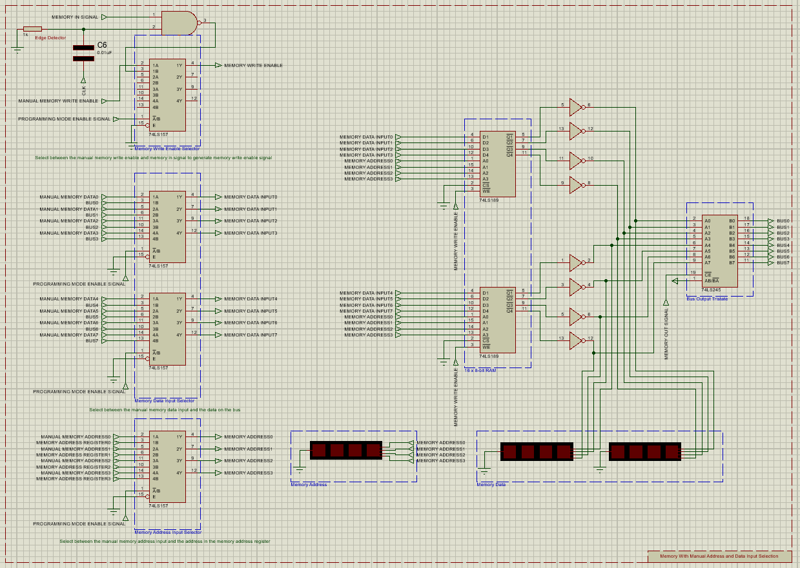

# Programmable_8-bit_Computer
Simulated programmable 8-bit computer from scratch using only simple logic gates and basic ICs

## Modules
[Clock](#clock)  
[Bus](#bus)  
[A-Register](#a-register)  
[B-Register](#b-register)  
[ALU](#alu)  
[Flags Register](#flags-register)  
[Memory Address Register](#memory-address-register)  
[Memory](#memory)  
[Manual Memory Input](#manual-memory-input)  
[Program Counter](#program-counter)  
[Output Display](#output-display)  

## Clock
Clock can operate in **two modes**:
- Astable Mode
- Monostable Mode

In __Astable Mode__ clock speed can be changed by adjusting the _potentiometer_

In __Monostable Mode__ single clock pulse can be generated by pressing the _Generate Clock Pulse Button_

### Main Components
- 2 X 555 ( Timer/Oscillator )

### Clock Selector Truth Table
| **Mode Selector Switch** | **Halt Signal** |   **Clock Output**  |
|:------------------------:|:---------------:|:-------------------:|
|            Low           |       Low       |     Astable Mode    |
|           High           |       Low       |   Monostable Mode   |
|             X            |       High      |         Low         |

### Schematic

## Bus
All modules are connected to the **Bus** using a **tristate** to connect multiple outputs together

The **Bus** is connected to _pull down resistors_ to pull the **Bus** to _ground_ by default if there is no input

### Schematic

## A-Register
**A-Register** is an 8-bit register combined from _two 4-bit_ registers

The **register** is connected to the [Bus](#bus) through a _Tristate_

The **register** also has a direct connection to [ALU](#alu)'s inputs

### Main Components
- 2 X 74LS173 ( Quad D-Type Filp-Flops With Tristate Outputs )
- 74LS245 ( Octal Bus Transceivers With Tristate Outputs )

### A-Register Signals
|       **Signal**      |                 **Functionality**                |
|:---------------------:|:------------------------------------------------:|
|  A Register In Signal | Read the [Bus](#bus) content into **A Register** |
| A Register Out Signal | Output **A Register** content to the [Bus](#bus) |
|   Active High Reset   |           Reset **A Register** content           |

### Schematic

## B-Register
**B-Register** is an 8-bit register combined from _two 4-bit_ registers

The **register** is connected to the [Bus](#bus) through a _Tristate_

The **register** also has a connection to [ALU](#alu)'s inputs through _XOR Gates_ that decide whether the **register**'s content should be negated or not based on the **Subtraction Signal** for _subtraction_ operations

### Main Components
- 2 X 74LS173 ( Quad D-Type Filp-Flops With Tristate Outputs )
- 74LS245 ( Octal Bus Transceivers With Tristate Outputs )
- 8 X 74LS86 ( 2-Input Exclusive-OR Gate )

### B-Register Signals
|       **Signal**      |                    **Functionality**                   |
|:---------------------:|:------------------------------------------------------:|
|  B Register In Signal |    Read the [Bus](#bus) content into **B Register**    |
| B Register Out Signal |    Output **B Register** content to the [Bus](#bus)    |
|    Subtract Signal    | Negate **B Register** content ( Get one's complement ) |
|   Active High Reset   |              Reset **B Register** content              |

**Note:** The **Control Unit** currently has no **Microinstruction** that controls the **B Register Out Signal**, and the signal is manually fixed to be _inactive (aka HIGH)_ 

### Schematic

## ALU
**ALU** is an 8-bit **Full Adder** combined from _two 4-bit_ **Full Adders**

Both [A-Register](#a-register) and [B-Register](#b-register) are connected to the **ALU**'s input, and the **ALU** is _constantly_ operating on them

**ALU** supports two **Arithmetic Operations**:
- Addition
- Subtraction

**Subtraction** is achieved when the **Subtraction Signal** is enabled _(Active **HIGH**)_, resulting in the [B-Register](#b-register)'s content to be negated, hence, getting **One's Complement**. And the **Subtraction Signal** is also fed to the **carry In** of the first **Full Adder** of the **ALU** **_(C0)_** _(Note the **Subtraction Signal** is active **HIGH**)_, hence, getting **Two's Complement**

**ALU** generates two **Flags**:
- Carry Flag
- Zero Flag

### Main Components
- 2 X 74LS283 ( 4-Bit Binary Full Adders With Fast Carry )
- 74LS245 ( Octal Bus Transceivers With Tristate Outputs )
- 74HC4078 ( 8-Input NOR Gate )

### ALU Signals
|    **Signal**   |                              **Functionality**                             |
|:---------------:|:--------------------------------------------------------------------------:|
|  ALU Out Signal |                  Output **ALU** content to the [Bus](#bus)                 |
| Subtract Signal | Fed to the **Carry In** for subtraction operation ( Get two's complement ) |

### Schematic

## Flags-Register
**Flags Register** is a 4-bit register, which stores the [ALU](#alu)'s two generated flags:
- Carry Flag
- Zero Flag

when the **Flags Register In Signal** is enabled

The **register**'s output flags are connected to the **Control Unit** 

### Main Components
- 74LS173 ( Quad D-Type Filp-Flops With Tristate Outputs )

### Flags-Register Signals
|        **Signal**        |                   **Functionality**                  |
|:------------------------:|:----------------------------------------------------:|
| Flags Register In Signal | Read [ALU](#alu)'s **Flags** into **Flags Register** |
|     Active High Reset    |           Reset **Flags Register** content           |

### Schematic

## Memory-Address-Register
**Memory Address Register** is a 4-bit register, which stores the 4-bit **memory** address where the **memory** is going to read and output this address content _(If it is **Run Mode**, otherwise in **Programming Mode**, the **memory** is going to use and output the content of the **Manual Address Input**)_

The **register**'s output is connected to the **Memory Address Input Selector** 

### Main Components
- 74LS173 ( Quad D-Type Filp-Flops With Tristate Outputs )

### Memory-Address-Register Signals
|        **Signal**        |                       **Functionality**                       |
|:------------------------:|:-------------------------------------------------------------:|
| Memory Address In Signal | Read the [Bus](#bus) content into **Memory Address Register** |
|     Active High Reset    |           Reset **Memory Address Register** content           |

### Schematic

## Memory
**Memory** is a **128-bit (16 X 8)** memory combined from _two 64-bit (16 X 4)_ **Random Access Read/Write Memory**

The **Memory** is connected to the [Bus](#bus) through a _Tristate_

The inputs **(Memory Data Input, Memory Address, and Memory Write Enable)** to the **Memory** is the outputs of the **Memory Data Input Selector/Multiplexer, Memory Address Input Selector/Multiplexer, and Memory Write Enable Selector/Multiplexer** where the:

- **Memory Data Input Selector/Multiplexer**: Decides whether the _manual memory data input_ or _the data on the [Bus](#bus)_ will be used as an input to the **Memory**

- **Memory Address Input Selector/Multiplexer**: Decides whether the _manual memory address input_ or _the address in the [Memory Address Register](#memory-address-register)_ will be used as an input to the **Memory**

- **Memory Write Enable Selector/Multiplexer**: Decides whether the _manual memory write enable_ or _the **Memory In Signal** with the positive edge of the clock_ will be used as an input to the **Memory**

The **Manual Inputs** referenced above are generated from the [Manual Memory Input Module](#manual-memory-input)

All **Selectors/Mutliplexers** selects the input to the **Memory** based on the **Programming Mode Enable Signal** generated also in the [Manual Memory Input Module](#manual-memory-input)

### Main Components
- 2 X 74LS189 ( 64-Bit Random Access Read/Write Memory )
- 4 X 74LS157 ( Quadruple 1-of-2 Data Selectors/Multiplexers )
- 74LS245 ( Octal Bus Transceivers With Tristate Outputs )

### Memory Signals
|           **Signal**           |                                     **Functionality**                                    |
|:------------------------------:|:----------------------------------------------------------------------------------------:|
|        Memory Out Signal       |                       Output **Memory** content to the [Bus](#bus)                       |
|        Memory In Signal        | Generates the **Memory Write Enable Pulse** with the **[Clock](#clock)'s positive edge** |
|       Memory Write Enable      |             Write the **Data** to the **Memory** at the specified **Address**            |
| Programming Mode Enable Signal |             Selects between the inputs of the two **Selectors/Multiplexers**             |

### Schematic

## Manual-Memory-Input
**Manual Memory Input** consists of:
- **Memory Address Manual Input**: Where the **4-bit [Memory](#memory) Address** is entered manually through the _Dip Switches_

- **Memory Data Manual Input**: Where the **8-bit [Memory](#memory) Data** is entered manually through the _Dip Switches_

- **Memory Manual Write Enable Input**: Where the **[Memory](#memory)'s Write Enable Signal** is generated manually by pressing the _Button_

- **Memory Programming/Run Mode Selector**: Generates the **Programming Mode Enable Signal** that selects between the **Programming Mode** where all the [Memory](#memory) inputs are supplied from the [Manual Memory Input Module](#manual-memory-input), and the **Run Mode** where all the [Memory](#memory) inputs are supplied from the corresponding source for each input as stated in the [Memory Module](#memory). _(Note the LEDs that indicate which mode you are operating in based on the state of the **Switch**)_

### Main Components
- DIPSW_4 ( Interactive DIP Switch 4 Independent Elements )
- DIPSW_8 ( Interactive DIP Switch 8 Independent Elements )
- Button ( SPST Push Button )
- Switch ( Interactive SPST Switch (Latched Action) )

### Manual Memory Input Signals
|           **Signal**           |                     **Functionality**                     |
|:------------------------------:|:---------------------------------------------------------:|
| Programming Mode Enable Signal | Selects between the **Programming Mode** and **Run Mode** |

### Schematic

## Program-Counter
**Program Counter** is a _4-bit binary counter_ which gets incremented with each **[Clock](#clock) pulse** if the **Program Counter Enable Signal** is enabled

The **Program Counter** also supports loading a _4-bit_ data from the [Bus](#bus) when the **Program Counter In Signal** is enabled _(Note that, this is used to implement the **Jump Instruction**)_ 

The **Program Counter**'s output is connected to the [Bus](#bus) through a _Tristate_, however, its input is connected to the [Bus](#bus) directly 

### Main Components
- 74LS161 ( Synchronous 4-Bit Binary Counters )
- 74LS245 ( Octal Bus Transceivers With Tristate Outputs )

### Program-Counter Signals
|           **Signal**          |                                  **Functionality**                                 |
|:-----------------------------:|:----------------------------------------------------------------------------------:|
|   Program Counter In Signal   |      Load the **lowest 4-bits** from the [Bus](#bus) into **Program Counter**      |
|   Program Counter Out Signal  |                Output **Program Counter** content to the [Bus](#bus)               |
| Program Counter Enable Signal | Enable **Program Counter** counting which is synchronized with the [Clock](#clock) |
|        Active Low Reset       |                          Reset **Program Counter** content                         |

### Schematic

## Output-Display
**Output Display Module** can be divided into sections and sub-modules:

- **Output Display**: _Four 7-Segments_, _three_ of which display **digits** while the _fourth_ display the **sign** ( Sign is supported but currently not utilized )

- **7-Segments Multiplexing Circuit**: Mutliplexes through the **Four 7-Segments** (After the **Arduino** finishes programming the **EEPORM**), using a **2-Bit Counter** (Counting from 0 to 3) and a **2 to 4 Decoder** that takes the **2-Bit Counter** output and outputs the four **Seven Segment Enable Signal**, where they select which **7-Segment** should be active at a time. The **Multiplexing Speed** can be adjusted using the **555 Timer**

- **Output Display Register**: 8-bit register which stores in binary the current **Output Display** value being displayed on the **7-Segments**. The **Register**'s _output_ is connected to the **Display EEPORM _address input_** through a _Tristate_ which enables the **Register**'s output to the **Display EEPORM** (After the **Arduino** finishes programming the **EEPORM**). The **Register**'s _input_ is connected directly to the [Bus](#bus)

- **Display EEPROM**: Programmed using the **Arduino** such as, it would take the _binary output display value_ from the **Output Display Register** as an **Address** to the **Display EEPROM**, and it outputs the **7-Segments** representation for each digit. The **EEPORM** has **four** sections for each the **Positive Numbers** and the **Negative Numbers (Two's Complement)**, **three** sections for each digit placement and the **fourth** is for the sign. These sections are:
    - Ones Place
    - Tens Place
    - Hundreds Place
    - Sign Place
    
    As that, the **_8-bit_ Output Display Register** value can be represented by up to _three digits_ and the _sign_ **( 0 to 255 for Positive representation )** and **( -127 to 128 for Negative representation )**
    
    ### Display EEPROM Content
    
    |   **Address**   |                   **7-Segments Digit**                  |
    |:---------------:|:-------------------------------------------------------:|
    |   **0 : 255**   |      **Ones Place** of the numbers **( 0 : 255 )**      |
    |  **256 : 511**  |      **Tens Place** of the numbers **( 0 : 255 )**      |
    |  **512 : 767**  |    **Hundreds Place** of the numbers **( 0 : 255 )**    |
    |  **768 : 1023** | Blank 7-Segments to indicate it is a **Positive Value** |
    | **1024 : 1279** |     **Ones Place** of the numbers **( -128 : 127 )**    |
    | **1280 : 1535** |     **Tens Place** of the numbers **( -128 : 127 )**    |
    | **1536 : 1791** |   **Hundreds Place** of the numbers **( -128 : 127 )**  |
    | **1792 : 2047** |  Output **"-"** to indicate it is a **Negative Value**  |

    From the **table**:

    - By controlling the **EEPROM**'s **Address bit 8** and **Address bit 9**, we can control which digit place and sign place we output for that **8-bit binary number** _(AKA the address of the EEPROM, which is fed from the **8-bit Output Display Register**)_

    - By controlling the **EEPROM**'s **Address bit 10**, we can select if that **8-bit binary number** _(AKA the address of the EEPROM, which is fed from the **8-bit Output Display Register**)_ should be represented as a **Positive Number** or as a **Negative Number (Two's Complement)**

- **Display EEPROM Programmer**: Programs the **Display EEPROM** as discussed. It outputs the **EEPROM Addresses** serially to _shift registers (to make them **parallel** as the number of the **Arduino** pins are limited)_, while it outputs the **EEPORM Data** parallelly. It is also connected to a **Serial Monitor** for outputting the state of the **EEPORM** programming  

### Main Components
- 4 X 7-Segments ( 7-Segments Common Cathode )
- 555 ( Timer/Oscillator )
- 2 X 74LS76 ( Dual JK Flip-Flops With Set And Reset )
- 74LS139 ( Dual 2-Line to 4-Line Decoders/Demultiplexers )
- 74LS273 ( Octal D-Type Positive-Edge-Triggered Flip-Flops With Clear )
- 62256 ( CMOS RAM (32k X 8-bit) )
- Arduino Nano ( ATMEGA328P )
- 2 X 74HC595 ( 8-Bit Shift Registers With Tristate Output Registers )
- 2 X 74LS245 ( Octal Bus Transceivers With Tristate Outputs )

### Ouput-Display Signals
|              **Signal**             |                                                               **Functionality**                                                              |
|:-----------------------------------:|:--------------------------------------------------------------------------------------------------------------------------------------------:|
|          Output Register In         |                                         Read the [Bus](#bus) content into **Output Display Register**                                        |
|   Display EEPROM Output Enable Bit  |                                           Indication that the **Arduino** finished its programming                                           |
|     Display EEPROM Write Enable     |                                      Write the data to the **Display EEPROM** with the provided address                                      |
|      Display EEPROM Address8/9      |                                       Select between the **three Digit Places** and the **Sign Place**                                       |
|       Display EEPROM Address10      | Select between the representation of the **Output Display Register** as a **Positive Number** or as a **Negative Number (Two's Complement)** |
| Display Seven Segments Switch Clock |                                     Clock that controls the speed of the **four 7-Segments** multiplexing                                    |
|           Active Low Reset          |                                                   Reset **Output Display Register** content                                                  |

### Schematic

