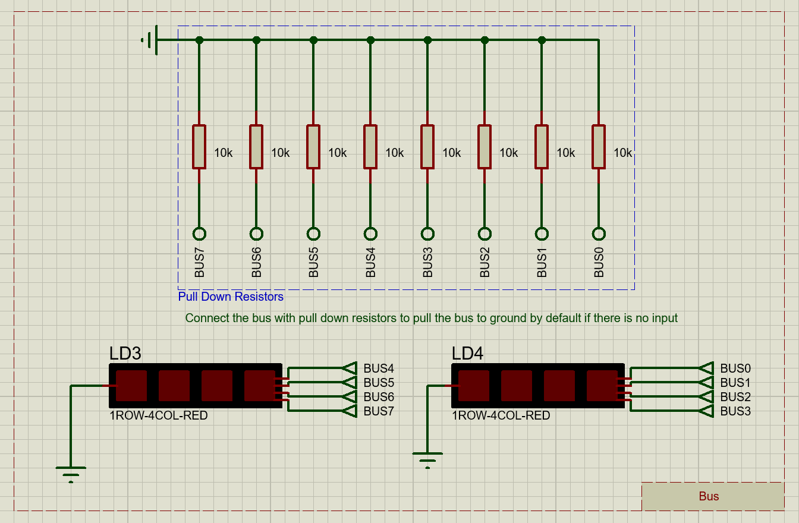

# Programmable_8-bit_Computer
Simulated programmable 8-bit computer from scratch using only simple logic gates and basic ICs

## Modules
[Clock](#clock)  
[Bus](#bus)  
[A-Register](#a-register)  
[B-Register](#b-register)  

## Clock
Clock can operate in **two modes**:
- Astable Mode
- Monostable Mode

In __Astable Mode__ clock speed can be changed by adjusting the _potentiometer_

In __Monostable Mode__ single clock pulse can be generated by pressing the _Generate Clock Pulse Button_

### Main Components
- 2 X 555 Timers

### Clock Selector Truth Table
| **Mode Selector Switch** | **Halt Signal** |   **Clock Output**  |
|:------------------------:|:---------------:|:-------------------:|
|            Low           |       Low       |     Astable Mode    |
|           High           |       Low       |   Monostable Mode   |
|             X            |       High      |         Low         |

### Schematic

## Bus
All modules are connected to the **Bus** using a **tristate** to connect multiple outputs together

The **Bus** is connected to _pull down resistors_ to pull the **Bus** to _ground_ by default if there is no input

### Schematic

## A-Register
**A-Register** is an 8-bit register combined from _two 4-bit_ registers

The **register** is connected to the [Bus](#bus) through a _Tristate_

The **register** also has a direct connection to _ALU_'s inputs

### Main Components
- 2 X 74LS173 ( Quad D-Type Filp-Flops With Tristate Outputs )
- 74LS245 ( Octal Bus Transceivers With Tristate Outputs )

### A-Register Signals
|       **Signal**      |                 **Functionality**                |
|:---------------------:|:------------------------------------------------:|
|  A Register In Signal | Read the [Bus](#bus) content into **A Register** |
| A Register Out Signal | Output **A Register** content to the [Bus](#bus) |
|   Active High Reset   |           Reset **A Register** content           |

### Schematic

## B-Register
**B-Register** is an 8-bit register combined from _two 4-bit_ registers

The **register** is connected to the [Bus](#bus) through a _Tristate_

The **register** also has a connection to _ALU_'s inputs through _XOR Gates_ that decide whether the **register**'s content should be negated or not based on the **Subtraction Signal** for _subtraction_ operations

### Main Components
- 2 X 74LS173 ( Quad D-Type Filp-Flops With Tristate Outputs )
- 74LS245 ( Octal Bus Transceivers With Tristate Outputs )
- 8 X 74LS86 ( 2-Input Exclusive-OR Gate )

### B-Register Signals
|       **Signal**      |                    **Functionality**                   |
|:---------------------:|:------------------------------------------------------:|
|  B Register In Signal |    Read the [Bus](#bus) content into **B Register**    |
| B Register Out Signal |    Output **B Register** content to the [Bus](#bus)    |
|    Subtract Signal    | Negate **B Register** content ( Get one's complement ) |
|   Active High Reset   |              Reset **B Register** content              |

**Note:** The **Control Unit** currently has no **Microinstruction** that controls the **B Register Out Signal**, and the signal is manually fixed to be _inactive (aka HIGH)_ 

### Schematic
